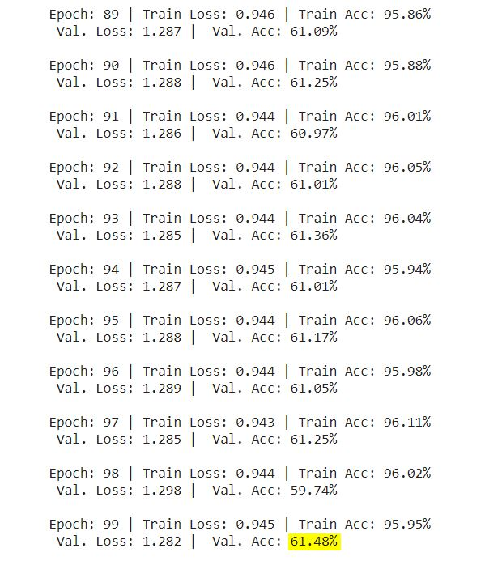
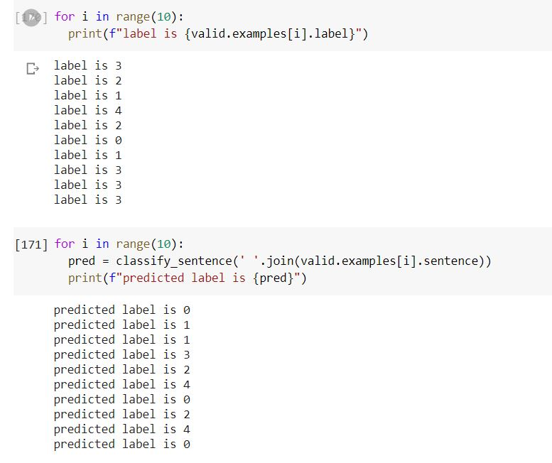

# Session 5 - Fist Hands On

1. Look at [this code](https://colab.research.google.com/drive/19wZi7P0Tzq9ZxeMz5EDmzfWFBLFWe6kN?usp=sharing&pli=1&authuser=3). It has additional details on "Back Translate", i.e. using Google translate to convert the sentences. It has "random_swap" function, as well as "random_delete". 
2. Use "Back Translate", "random_swap" and "random_delete" to augment the data you are training on
3. Download the StanfordSentimentAnalysis Dataset from this [link](http://nlp.stanford.edu/~socherr/stanfordSentimentTreebank.zip) (it might be troubling to download it, so force download on chrome). Use "datasetSentences.txt" and "sentiment_labels.txt" files from the zip you just downloaded as your dataset. This dataset contains just over 10,000 pieces of Stanford data from HTML files of Rotten Tomatoes. The sentiments are rated between 1 and 25, where one is the most negative and 25 is the most positive.
4. Train your model and achieve **60%+ validation/text accuracy**. Upload your colab file on GitHub with readme that contains details about your assignment/word (minimum **250 words**), **training logs showing final validation accuracy, and outcomes for 10 example inputs from the test/validation data.**

## Input Data Preparation

### Stanford Sentiment Analysis TreeBank

The original dataset includes:

1. original_rt_snippets.txt contains 10,605 processed snippets from the original pool of Rotten Tomatoes HTML files. Please note that some snippet may contain multiple sentences.
2. dictionary.txt contains all phrases and their IDs, separated by a vertical line |
3. sentiment_labels.txt contains all phrase ids and the corresponding sentiment labels, separated by a vertical line. Note that you can recover the 5 classes by mapping the positivity probability using the following cut-offs: [0, 0.2], (0.2, 0.4], (0.4, 0.6], (0.6, 0.8], (0.8, 1.0] for very negative, negative, neutral, positive, very positive, respectively. Please note that phrase ids and sentence ids are not the same.
4. SOStr.txt and STree.txt encode the structure of the parse trees. STree encodes the trees in a parent pointer format. Each line corresponds to each sentence in the datasetSentences.txt file. The Matlab code of this paper will show you how to read this format if you are not familiar with it.
5. datasetSentences.txt contains the sentence index, followed by the sentence string separated by a tab. These are the sentences of the train/dev/test sets.
6. datasetSplit.txt contains the sentence index (corresponding to the index in datasetSentences.txt file) followed by the set label separated by a comma: 1 = train 2 = test 3 = dev

Please note that the datasetSentences.txt file has more sentences/lines than the original_rt_snippet.txt. Each row in the latter represents a snippet as shown on RT, whereas the former is each sub sentence as determined by the Stanford parser.

### Data Handling

For the purpose of this notebook, we do the following:

1. From datasentences.txt, we take each sentence and find the corresponding "phrase ids" in dictionary.txt by checking the presence of "sentence" in "phrase".
2. Using the "phrase ids" we retrieve the "sentiment values" from sentiment_labels.txt.

### Training and Test Dataset

After applying above techniques we get a combined DataFrame that has the following fields:

1. **sentence_index** : Original sentence_index in the datasetSentences.txt
2. **sentence**: The actual sentence
3. **phrase ids**: The Phrase_Id used for mapping/retrieving sentiment score
4. **sentiment values**: Actual Sentiment score for the sentence

## Training Logs

## Validations

